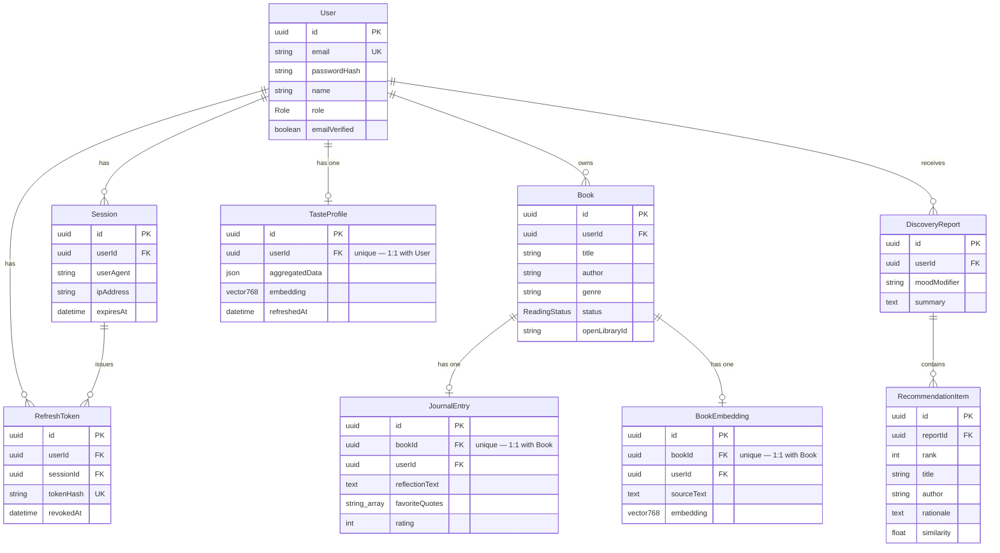

# Folio — Architecture

Folio is a personal reading journal with an AI "taste discovery" feature: readers
log books and reflections, and a retrieval-augmented pipeline recommends real,
verifiable books that match their taste.

## 1. Entity Relationship Diagram

The schema is implemented in Prisma and backed by PostgreSQL with the `pgvector`
extension. It reflects the applied migration `20260708111848_init`.



### Design notes

- **Auth cluster** (`User` → `Session` → `RefreshToken`): unchanged behaviour from
  the starter kit, now in Prisma. All children cascade-delete with the user.
  `RefreshToken.tokenHash` is unique; each token also carries a unique `jti` so
  rotation never produces a duplicate hash.
- **Library cluster**: a `User` owns many `Book`s. Each `Book` has **at most one**
  `JournalEntry` and **at most one** `BookEmbedding` (both enforced by a unique
  `bookId`). Dedup on `Book` uses a unique `(userId, openLibraryId)` as the
  primary key for Open-Library-sourced books and `(userId, title, author)` as a
  fallback for manually entered ones.
- **Taste + discovery**: a `User` has one `TasteProfile` (a rating-weighted
  average embedding plus a small JSON summary). A `DiscoveryReport` holds exactly
  three `RecommendationItem`s, each copied verbatim from a real Open Library
  candidate.
- **pgvector**: `BookEmbedding.embedding` and `TasteProfile.embedding` are
  `vector(768)` — the dimension `nomic-embed-text` actually returns (verified
  against a live response, not assumed).
```
