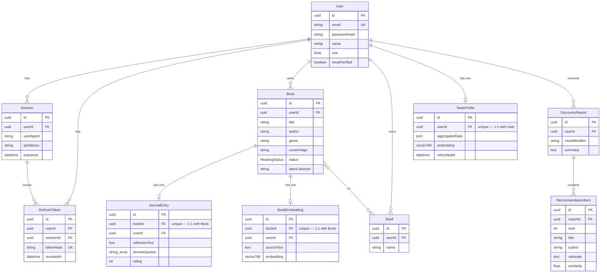

# Folio — Architecture

Folio is a personal reading journal with an AI "taste discovery" feature: readers
log books and reflections, and a retrieval-augmented pipeline recommends real,
verifiable books that match their taste.

## 1. Entity Relationship Diagram

The schema is implemented in Prisma and backed by PostgreSQL with the `pgvector`
extension. It reflects the applied migrations (`..._init`, `..._add_abandoned_status`,
`..._add_book_cover_image`, `..._add_shelf_model`).

### Design notes

- **Auth cluster** (`User` → `Session` → `RefreshToken`): unchanged behaviour from
  the starter kit, now in Prisma. All children cascade-delete with the user.
  `RefreshToken.tokenHash` is unique; each token also carries a unique `jti` so
  rotation never produces a duplicate hash.
- **Reading lifecycle** — `Book.status` (enum `ReadingStatus`) has four states:
  `WANT_TO_READ` → `READING` → `FINISHED` → `ABANDONED`. This is the reading
  *status* and is distinct from shelves.
- **Shelves** — a `Shelf` is a user-created named collection, many-to-many with
  `Book` (a book can sit on several shelves). Shelves **complement** the reading
  lifecycle rather than replace it. Cross-account **shared shelves** (joint
  view/write access) are designed in §2 but deferred from the schema for now.
- **Library cluster**: a `User` owns many `Book`s (each with an optional
  `coverImage` URL). Each `Book` has **at most one** `JournalEntry` and **at most
  one** `BookEmbedding` (both enforced by a unique `bookId`). Dedup on `Book` uses
  a unique `(userId, openLibraryId)` as the primary match for Open-Library-sourced
  books and `(userId, title, author)` as a fallback for manually entered ones.
- **Taste + discovery**: a `User` has one `TasteProfile` (a rating-weighted
  average embedding plus a small JSON summary). A `DiscoveryReport` holds exactly
  three `RecommendationItem`s, each copied verbatim from a real Open Library
  candidate.
- **pgvector**: `BookEmbedding.embedding` and `TasteProfile.embedding` are
  `vector(768)` — the dimension `nomic-embed-text` actually returns (verified
  against a live response, not assumed).

## 2. API contract

All routes are under `/api`. Auth is via an httpOnly `accessToken` cookie
(`authenticate` middleware); role checks use the `authorize` middleware.
Status legend: ✅ implemented · 🔶 scaffolded (stub) · 🔷 planned.

Standard envelopes: success `{ "data": ... }`; error `{ "error": "message" }`;
validation error `{ "error": "Validation failed", "errors": [{ "field", "message" }] }`.

### Auth — ✅ implemented

| Method | Path | Auth | Request body | Response |
| --- | --- | --- | --- | --- |
| POST | `/api/auth/register` | public | `{ email, password, name }` | `201 { data: { id, email, name, role } }` |
| POST | `/api/auth/login` | public | `{ email, password }` | `200 { data: { user } }` + auth cookies |
| POST | `/api/auth/refresh` | refresh cookie | — | `200 { data: { message } }` + rotated cookies |
| POST | `/api/auth/logout` | user | — | `200 { data: { message } }` |
| GET | `/api/auth/me` | user | — | `200 { data: { id, email, name, role, emailVerified, createdAt } }` |

### Books — 🔶 scaffolded (Owner-scoped)

| Method | Path | Auth | Request body | Response |
| --- | --- | --- | --- | --- |
| GET | `/api/books` | user | — (query: `status?`, `q?`) | `200 { data: Book[] }` |
| POST | `/api/books` | user | `{ title, author, genre?, coverImage?, status?, openLibraryId? }` | `201 { data: Book }` |
| GET | `/api/books/:id` | owner | — | `200 { data: Book }` |
| PATCH | `/api/books/:id` | owner | `{ title?, author?, genre?, coverImage?, status? }` | `200 { data: Book }` |
| DELETE | `/api/books/:id` | owner | — | `204` |
| GET | `/api/books/:id/journal` | owner | — | `200 { data: JournalEntry \| null }` |
| PUT | `/api/books/:id/journal` | owner | `{ reflectionText, favoriteQuotes?, rating? }` | `200 { data: JournalEntry }` (upsert; 1:1) |

### Shelves — 🔶 scaffolded (Owner-scoped; user-created collections)

| Method | Path | Auth | Request body | Response |
| --- | --- | --- | --- | --- |
| GET | `/api/shelves` | user | — | `200 { data: Shelf[] }` |
| POST | `/api/shelves` | user | `{ name }` | `201 { data: Shelf }` |
| GET | `/api/shelves/:id` | owner | — | `200 { data: Shelf & { books: Book[] } }` |
| PATCH | `/api/shelves/:id` | owner | `{ name }` | `200 { data: Shelf }` |
| DELETE | `/api/shelves/:id` | owner | — | `204` |
| POST | `/api/shelves/:id/books` | owner | `{ bookId }` | `200 { data: Shelf }` (add book to shelf) |
| DELETE | `/api/shelves/:id/books/:bookId` | owner | — | `204` (remove book from shelf) |

Lifecycle filtering (want-to-read / reading / finished / abandoned) is
`GET /api/books?status=…`, not a shelf.

#### Shelf sharing — 🔷 planned (design only, not yet in the schema)

Per review: a user can link accounts with another user and grant them **view**
or **write** access to a specific shelf. Planned model — a `ShelfShare` join
(`shelfId`, `userId`, `accessLevel` ∈ `VIEW | WRITE`, invite status) plus an
account-link / invite-accept flow. Deferred from the current migration; the
endpoints below are indicative.

| Method | Path | Auth | Request body | Response |
| --- | --- | --- | --- | --- |
| GET | `/api/shelves/:id/shares` | owner | — | `200 { data: ShelfShare[] }` |
| POST | `/api/shelves/:id/shares` | owner | `{ email, accessLevel }` | `201 { data: ShelfShare }` (invite) |
| DELETE | `/api/shelves/:id/shares/:userId` | owner | — | `204` (revoke) |

### Analytics — 🔶 scaffolded (Owner-scoped)

| Method | Path | Auth | Request body | Response |
| --- | --- | --- | --- | --- |
| GET | `/api/analytics` | user | — | `200 { data: { totalBooks, byStatus, byGenre, averageRating, finishedThisYear } }` |

### AI discovery — 🔶 scaffolded (Owner-scoped)

| Method | Path | Auth | Request body | Response |
| --- | --- | --- | --- | --- |
| POST | `/api/ai/taste-profile/refresh` | user | — | `200 { data: { refreshedAt, aggregatedData } }` |
| GET | `/api/ai/taste-profile` | user | — | `200 { data: TasteProfile }` |
| POST | `/api/ai/discovery-report` | user | `{ moodModifier? }` | `201 { data: DiscoveryReport & { items: RecommendationItem[] } }` |
| GET | `/api/ai/discovery-reports` | user | — | `200 { data: DiscoveryReport[] }` |
| GET | `/api/ai/discovery-report/:id` | owner | — | `200 { data: DiscoveryReport & { items } }` |

### Contributors — 🔶 scaffolded (folds into Shelf sharing)

"Contributors" was a placeholder; per review it maps to **shelf collaborators** —
the users who share view/write access to a shelf. It is being subsumed by the
Shelf sharing design above; the standalone route likely reduces to "people I
share shelves with".

| Method | Path | Auth | Request body | Response |
| --- | --- | --- | --- | --- |
| GET | `/api/contributors` | user | — | `200 { data: Contributor[] }` (collaborators across the user's shared shelves) |

### Admin — 🔶 scaffolded (Admin-only, `role = admin`)

| Method | Path | Auth | Request body | Response |
| --- | --- | --- | --- | --- |
| GET | `/api/admin/users` | admin | — | `200 { data: User[] }` |
| GET | `/api/admin/users/:id` | admin | — | `200 { data: User }` |
| PATCH | `/api/admin/users/:id` | admin | `{ role?, emailVerified? }` | `200 { data: User }` |
| DELETE | `/api/admin/users/:id` | admin | — | `204` |
| GET | `/api/admin/stats` | admin | — | `200 { data: { userCount, bookCount, reportCount } }` |

> **Note — Contributors → Shelf sharing.** Originally a placeholder; per review it
> is the shelf-collaborators concept (people with shared view/write access). Its
> concrete shape follows the Shelf sharing model once that lands; the scaffolded
> `/api/contributors` route stays a `501` stub until then.

## 3. AI integration

- **What.** A retrieval-augmented "taste discovery" flow. The system embeds a
  user's finished books (genre + author + reflection + favourite quotes), averages
  them into a rating-weighted `TasteProfile` vector, retrieves **real** candidate
  books from the Open Library Subjects API, ranks them by pgvector cosine
  similarity, and has a generation model write the rationale over the top
  candidates. The model never invents titles — it selects from verified candidates.
- **Where.** The provider wrapper lives in `packages/shared/ai`; embedding jobs run
  in `packages/workers`; the discovery/taste endpoints live in `packages/api`
  under `/api/ai/*`.
- **Provider.** **Self-hosted Ollama on local-network infrastructure** (the address
  is configured via `OLLAMA_BASE_URL` in the local `.env`, never committed).
  - Embedding model: `nomic-embed-text` (768-dim).
  - Generation model: **pending** a side-by-side bake-off between `gemma4:26b` and
    `qwen3.6:27b-64k`; the winner will be recorded here.
- **Why self-hosted.** Two reasons: **cost** (no per-token cloud fees for what is a
  high-volume embedding workload) and **data locality** (see §4).
- **Failure mode.** If the Ollama host is unreachable, AI endpoints fail with a
  clear error rather than silently falling back to a cloud provider — that would be
  a cost and data-locality decision, made deliberately, not automatically.

## 4. Data privacy

- **What data is involved.** The AI flow processes the user's own content: journal
  reflection text, favourite quotes, ratings, and book genre/author metadata. These
  are sent to the Ollama instance to produce embeddings and recommendation
  rationale.
- **What leaves the system.** **Nothing leaves the network.** Because the AI
  provider is self-hosted on infrastructure under our control, journal text and
  reading data are never transmitted to a third-party model or external API. This
  is a deliberate advantage of the self-hosted choice, not an incidental one.
- **Third-party calls that do go out.** Only the Open Library Subjects API — a
  free, unauthenticated, read-only lookup that receives *subject/genre keywords*,
  never the user's journal content. Requests carry a descriptive `User-Agent` per
  Open Library's guidance.
- **Secrets & addresses.** No credentials are committed. The Ollama LAN address
  lives only in the gitignored `.env`; `.env.example` carries a placeholder.
