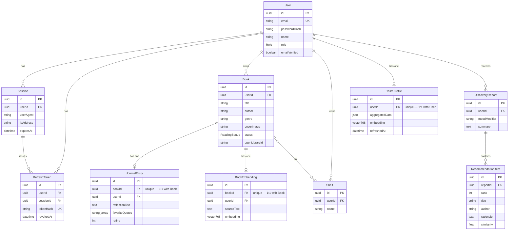

# Folio — Architecture

Folio is a personal reading journal with an AI "taste discovery" feature: readers
log books and reflections, and a retrieval-augmented pipeline recommends real,
verifiable books that match their taste.

## 1. Entity Relationship Diagram

The schema is implemented in Prisma and backed by PostgreSQL with the `pgvector`
extension. It reflects the applied migrations (`..._init`, `..._add_abandoned_status`,
`..._add_book_cover_image`, `..._add_shelf_model`).

```mermaid
erDiagram
    User ||--o{ Session : "has"
    User ||--o{ RefreshToken : "has"
    Session ||--o{ RefreshToken : "issues"
    User ||--o{ Book : "owns"
    User ||--o{ Shelf : "owns"
    User ||--o| TasteProfile : "has one"
    User ||--o{ DiscoveryReport : "receives"
    Book ||--o| JournalEntry : "has one"
    Book ||--o| BookEmbedding : "has one"
    Book }o--o{ Shelf : "on"
    DiscoveryReport ||--o{ RecommendationItem : "contains"

    User {
        uuid id PK
        string email UK
        string passwordHash
        string name
        Role role
        boolean emailVerified
    }
    Session {
        uuid id PK
        uuid userId FK
        string userAgent
        string ipAddress
        datetime expiresAt
    }
    RefreshToken {
        uuid id PK
        uuid userId FK
        uuid sessionId FK
        string tokenHash UK
        datetime revokedAt
    }
    Book {
        uuid id PK
        uuid userId FK
        string title
        string author
        string genre
        string coverImage
        ReadingStatus status
        string openLibraryId
    }
    Shelf {
        uuid id PK
        uuid userId FK
        string name
    }
    JournalEntry {
        uuid id PK
        uuid bookId FK "unique — 1:1 with Book"
        uuid userId FK
        text reflectionText
        string_array favoriteQuotes
        int rating
    }
    BookEmbedding {
        uuid id PK
        uuid bookId FK "unique — 1:1 with Book"
        uuid userId FK
        text sourceText
        vector768 embedding
    }
    TasteProfile {
        uuid id PK
        uuid userId FK "unique — 1:1 with User"
        json aggregatedData
        vector768 embedding
        datetime refreshedAt
    }
    DiscoveryReport {
        uuid id PK
        uuid userId FK
        string moodModifier
        text summary
    }
    RecommendationItem {
        uuid id PK
        uuid reportId FK
        int rank
        string title
        string author
        text rationale
        float similarity
    }
```

### Design notes

- **Auth cluster** (`User` → `Session` → `RefreshToken`): unchanged behaviour from
  the starter kit, now in Prisma. All children cascade-delete with the user.
  `RefreshToken.tokenHash` is unique; each token also carries a unique `jti` so
  rotation never produces a duplicate hash.
- **Reading lifecycle** — `Book.status` (enum `ReadingStatus`) has four states:
  `WANT_TO_READ` → `READING` → `FINISHED` → `ABANDONED`. This is the reading
  *status* and is distinct from shelves.
- **Shelves** — a `Shelf` is a user-created named collection, many-to-many with
  `Book` (a book can sit on several shelves). Shelves **complement** the reading
  lifecycle rather than replace it. Cross-account **shared shelves** (joint
  view/write access) are designed in §2 but deferred from the schema for now.
- **Library cluster**: a `User` owns many `Book`s (each with an optional
  `coverImage` URL). Each `Book` has **at most one** `JournalEntry` and **at most
  one** `BookEmbedding` (both enforced by a unique `bookId`). Dedup on `Book` uses
  a unique `(userId, openLibraryId)` as the primary match for Open-Library-sourced
  books and `(userId, title, author)` as a fallback for manually entered ones.
- **Taste + discovery**: a `User` has one `TasteProfile` (a rating-weighted
  average embedding plus a small JSON summary). A `DiscoveryReport` holds exactly
  three `RecommendationItem`s, each copied verbatim from a real Open Library
  candidate.
- **pgvector**: `BookEmbedding.embedding` and `TasteProfile.embedding` are
  `vector(768)` — the dimension `nomic-embed-text` actually returns (verified
  against a live response, not assumed).

## 2. API contract

All routes are under `/api`. Auth is via an httpOnly `accessToken` cookie
(`authenticate` middleware); role checks use the `authorize` middleware.
Status legend: ✅ implemented · 🔶 scaffolded (stub) · 🔷 planned.

Standard envelopes: success `{ "data": ... }`; error `{ "error": "message" }`;
validation error `{ "error": "Validation failed", "errors": [{ "field", "message" }] }`.

### Auth — ✅ implemented

| Method | Path | Auth | Request body | Response |
| --- | --- | --- | --- | --- |
| POST | `/api/auth/register` | public | `{ email, password, name }` | `201 { data: { id, email, name, role } }` |
| POST | `/api/auth/login` | public | `{ email, password }` | `200 { data: { user } }` + auth cookies |
| POST | `/api/auth/refresh` | refresh cookie | — | `200 { data: { message } }` + rotated cookies |
| POST | `/api/auth/logout` | user | — | `200 { data: { message } }` |
| GET | `/api/auth/me` | user | — | `200 { data: { id, email, name, role, emailVerified, createdAt } }` |

### Auth — password reset — ✅ implemented

| Method | Path | Auth | Request body | Response |
| --- | --- | --- | --- | --- |
| POST | `/api/auth/forgot-password` | public | `{ email }` | `200` — identical body whether or not the address has an account |
| POST | `/api/auth/reset-password` | public | `{ token, password }` | `200`; consumes the single-use token and revokes every session |

Tokens are stored as sha256 hashes only, live one hour, and one live link exists
per account. In development the reset link is printed to the API console behind a
banner (the email worker is a mock).

### Books — ✅ implemented (Owner-scoped)

| Method | Path | Auth | Request body | Response |
| --- | --- | --- | --- | --- |
| GET | `/api/books` | user | — (query: `status?`, `genre?`, `author?`, `q?`, `sort?`) | `200 { data: Book[] }` |
| POST | `/api/books` | user | `{ title, author, genre?, coverImage?, year?, pageCount?, format?, status?, openLibraryId? }` | `201 { data: Book }` |
| GET | `/api/books/catalog-search` | user | — (query: `q`) | `200 { data: CatalogResult[] }` (Open Library proxy; 502 when the catalog is down — the form never blocks on it) |
| POST | `/api/books/cover` | user | raw `application/octet-stream` image bytes | `201 { data: { url } }` (type sniffed from magic bytes, 5 MB cap) |
| GET | `/api/books/:id` | owner | — | `200 { data: Book }` |
| PATCH | `/api/books/:id` | owner | `{ title?, author?, genre?, coverImage?, year?, pageCount?, format?, status? }` | `200 { data: Book }` |
| DELETE | `/api/books/:id` | owner | — | `204` |
| GET | `/api/books/:id/similar` | owner | — | `200 { data: { status: "ok"\|"thin", items } }` — pgvector neighbours from the reader's own library only |
| POST | `/api/books/:id/share` | owner | `{ email }` | `201` — share one book with one named, existing reader (design E18) |
| GET | `/api/books/:id/shares` | owner | — | `200 { data: [{ shareId, recipient, sharedAt }] }` |
| GET | `/api/books/:id/journal` | owner | — | `200 { data: JournalEntry \| null }` |
| PUT | `/api/books/:id/journal` | owner | `{ reflectionText, favoriteQuotes?, rating? }` | `200 { data: JournalEntry }` (upsert; gated on FINISHED; every save re-queues the book's embedding) |

`format` is `PHYSICAL | EBOOK | AUDIOBOOK` — a label for the reader's own
filtering. Folio never stores or opens book files.

### Book shares — ✅ implemented (design E18)

| Method | Path | Auth | Request body | Response |
| --- | --- | --- | --- | --- |
| GET | `/api/book-shares/sent` | user | — | `200 { data: SentShare[] }` |
| GET | `/api/book-shares/received` | user | — | `200 { data: ReceivedShare[] }` — catalogue metadata + sender name, nothing else (see §4) |
| DELETE | `/api/book-shares/:shareId` | sender | — | `204` ("Take it back") |

### Shelves — ✅ implemented (Owner-scoped; user-created collections)

| Method | Path | Auth | Request body | Response |
| --- | --- | --- | --- | --- |
| GET | `/api/shelves` | user | — | `200 { data: Shelf[] }` |
| POST | `/api/shelves` | user | `{ name }` | `201 { data: Shelf }` |
| GET | `/api/shelves/:id` | owner | — | `200 { data: Shelf & { books: Book[] } }` |
| PATCH | `/api/shelves/:id` | owner | `{ name }` | `200 { data: Shelf }` |
| DELETE | `/api/shelves/:id` | owner | — | `204` |
| POST | `/api/shelves/:id/books` | owner | `{ bookId }` | `200 { data: Shelf }` (add book to shelf) |
| DELETE | `/api/shelves/:id/books/:bookId` | owner | — | `204` (remove book from shelf) |

Lifecycle filtering (want-to-read / reading / finished / abandoned) is
`GET /api/books?status=…`, not a shelf.

#### Shelf sharing — ✅ implemented

`ShelfShare` (`shelfId`, `userId`, `accessLevel` ∈ `VIEW | WRITE`, invite
status `PENDING | ACCEPTED | DECLINED`). Access is scoped to the shelf and its
books' catalogue metadata only — never the owner's journals, ratings, or
metrics (enforced in the contributors service, pinned by `contributors.test.ts`).

| Method | Path | Auth | Request body | Response |
| --- | --- | --- | --- | --- |
| GET | `/api/shelves/:shelfId/shares` | owner | — | `200 { data: ShelfShare[] }` |
| POST | `/api/shelves/:shelfId/shares` | owner | `{ email, accessLevel }` | `201 { data: ShelfShare }` (invite) |
| DELETE | `/api/shelves/:shelfId/shares/:userId` | owner | — | `204` (revoke) |

### Analytics — ✅ implemented (Owner-scoped)

| Method | Path | Auth | Request body | Response |
| --- | --- | --- | --- | --- |
| GET | `/api/analytics/summary` | user | — | `200 { data: { totalFinished, averageRating, genreBreakdown, velocity } }` |

The path is `/analytics/summary`, not `/analytics` — a contract test
(`packages/api/tests/contract/web-routes.test.ts`) extracts every path the web
client requests and fails the suite if one doesn't resolve against the
registered route table, so this class of drift can't ship silently again.

### AI — ✅ implemented (Owner-scoped)

| Method | Path | Auth | Request body | Response |
| --- | --- | --- | --- | --- |
| POST | `/api/ai/taste-profile/refresh` | user | — | `200 { data: { refreshedAt, aggregatedData } }` |
| GET | `/api/ai/taste-profile` | user | — | `200 { data: TasteProfile }` |
| POST | `/api/ai/discovery-report` | user | `{ moodModifier? }` | `201 { data: DiscoveryReport & { items } }` — 422 with an actionable message until a taste profile exists |
| GET | `/api/ai/discovery-reports` | user | — | `200 { data: DiscoveryReport[] }` |
| GET | `/api/ai/discovery-report/:id` | owner | — | `200 { data: DiscoveryReport & { items } }` |
| POST | `/api/ai/journal-prompts/:bookId` | owner | — | `200 { data: { prompts } }` — three openers from book metadata alone; nothing persisted (design B8a) |
| POST | `/api/ai/mood-shelf` | user | `{ mood, force? }` | `200 { data: { status: "ok"\|"thin", title?, items? } }` — built from the reader's own library; the mood is never stored (design D16) |
| GET | `/api/ai/memory/overview` | user | — | `200 { data: { entryCount, wordCount } }` |
| POST | `/api/ai/memory/search` | user | `{ query }` | `200 { data: { mode: "semantic"\|"exact", hits } }` — searches are not kept (design G19) |
| GET | `/api/ai/year-in-reading` | user | — (query: `year?`) | `200 { data: { status: "ok"\|"tooEarly", stats, narrative } }` — counts always available; `narrative` is null when the model doesn't answer (design G20) |

### Contributors — ✅ implemented

| Method | Path | Auth | Request body | Response |
| --- | --- | --- | --- | --- |
| GET | `/api/contributors` | user | — | outgoing: people the user shares shelves with |
| GET | `/api/contributors/invites` | user | — | incoming invites awaiting an answer |
| GET | `/api/contributors/shelves` | contributor | — | shelves shared with the user (metadata-only book projection) |
| POST | `/api/contributors/shelves/:shelfId/books` | WRITE contributor | `{ bookId }` | add one of your own books to a shared shelf |
| DELETE | `/api/contributors/shelves/:shelfId/books/:bookId` | WRITE contributor | — | remove a book you added |
| POST | `/api/shelves/:shelfId/shares/accept` · `/decline` | invitee | — | answer an invite |

### Admin — ✅ implemented (Admin-only, `role = admin`)

| Method | Path | Auth | Request body | Response |
| --- | --- | --- | --- | --- |
| GET | `/api/admin/users` | admin | — | `200 { data: User[] }` (with book counts) |
| PATCH | `/api/admin/users/:id` | admin | `{ role?, emailVerified? }` | `200 { data: User }` |
| DELETE | `/api/admin/users/:id` | admin | — | `204` — two-step typed confirmation in the console; logged before execution |
| GET | `/api/admin/stats` | admin | — | `200 { data: { userCount, bookCount, reportCount, signups7d, activeUsers30d, reportsPerDay, cohorts } }` |
| GET | `/api/admin/audit` | admin | — | `200 { data: AuditEntry[] }` — survives actor/target deletion (denormalized emails, no FKs) |

## 3. AI integration

- **What.** A retrieval-augmented "taste discovery" flow. The system embeds a
  user's finished books (genre + author + reflection + favourite quotes), averages
  them into a rating-weighted `TasteProfile` vector, retrieves **real** candidate
  books from the Open Library Subjects API, ranks them by pgvector cosine
  similarity, and has a generation model write the rationale over the top
  candidates. The model never invents titles — it selects from verified candidates.
- **Where.** The provider wrapper lives in `packages/shared/ai`; embedding jobs run
  in `packages/workers`; the discovery/taste endpoints live in `packages/api`
  under `/api/ai/*`.
- **Provider.** **Self-hosted Ollama on local-network infrastructure** (the address
  is configured via `OLLAMA_BASE_URL` in the local `.env`, never committed).
  - Embedding model: `nomic-embed-text` (768-dim).
  - Generation model: **pending** a side-by-side bake-off between `gemma4:26b` and
    `qwen3.6:27b-64k`; the winner will be recorded here.
- **Why self-hosted.** Two reasons: **cost** (no per-token cloud fees for what is a
  high-volume embedding workload) and **data locality** (see §4).
- **Failure mode.** If the Ollama host is unreachable, AI endpoints fail with a
  clear error rather than silently falling back to a cloud provider — that would be
  a cost and data-locality decision, made deliberately, not automatically.

### The pgvector path (embedding on write)

1. Saving a journal entry (`PUT /books/:id/journal`) enqueues an `embed-book`
   job on the BullMQ `embeddings` queue; so does moving an already-journaled
   book back to FINISHED. Enqueueing is best-effort — a blip in Redis never
   fails the reader's save.
2. The worker (`packages/workers`, started by `npm run dev`) re-checks that the
   book is FINISHED with a journal entry, builds the source text
   (genre + author + reflection + quotes), embeds it via `nomic-embed-text`,
   and upserts the 768-dim vector into `book_embeddings` with raw SQL (the
   column is `Unsupported("vector(768)")` to the Prisma client). In practice a
   reflection is searchable ~15 seconds after saving.
3. Every retrieval feature reads those vectors with pgvector cosine distance,
   **restricted to the requesting user's own rows**: similar books (B7a), mood
   shelves (D16), memory search (G19), and the taste-profile centroid that
   feeds discovery (D13–D15).
4. **Degrade:** when the embedding host is down, memory search falls back to
   plain word search over the same journal entries and flags `mode: "exact"` —
   the page keeps working and says so. Generation-dependent surfaces (prompts,
   whys, narratives) state their absence; retrieval-ranked results stand
   without prose where possible.

## 4. Data privacy

- **What data is involved.** The AI flow processes the user's own content: journal
  reflection text, favourite quotes, ratings, and book genre/author metadata. These
  are sent to the Ollama instance to produce embeddings and recommendation
  rationale.
- **What leaves the system.** **Nothing leaves the network.** Because the AI
  provider is self-hosted on infrastructure under our control, journal text and
  reading data are never transmitted to a third-party model or external API. This
  is a deliberate advantage of the self-hosted choice, not an incidental one.
- **Third-party calls that do go out.** Only the Open Library Subjects API — a
  free, unauthenticated, read-only lookup that receives *subject/genre keywords*,
  never the user's journal content. Requests carry a descriptive `User-Agent` per
  Open Library's guidance.
- **Secrets & addresses.** No credentials are committed. The Ollama LAN address
  lives only in the gitignored `.env`; `.env.example` carries a placeholder.
- **The E18 boundary (per-book sharing).** The recipient projection of a shared
  book selects exactly: title, author, genre, cover, year, page count, and the
  sender's name. It never selects the owner's reading status, journal text,
  quotes, rating, or dates — the SELECT list in `book-shares.service.ts` is the
  boundary, there is no setting that widens it, and
  `tests/integration/book-shares.test.ts` pins it (the recipient's response is
  asserted to contain no journal text, no rating, no status, and the owner's
  book/journal endpoints stay 404 for them).
- **Moods and searches are not stored.** D16 mood text and G19 search queries
  are used for the one request and discarded; journal prompts are generated
  from book metadata alone.

## 5. Motion

Motion follows the design's 0M spec: three durations (`instant` 80ms, `short`
140ms, `considered` 220ms) and two curves (`settle` for entrances, `retire`
for exits) as Tailwind `transitionDuration` / `transitionTimingFunction`
tokens. Patterns are applied only to frames the canvas marks with a MOTION
annotation. A global `prefers-reduced-motion` rule in
`packages/web/src/styles/globals.css` collapses every animation and transition
to 0.01ms with a single iteration — which also stops the otherwise-infinite
`think` loop.

## 6. Where the design lives

- `planning-reference/design/folio-v2.html` — the exported design canvas
  (81 frames, sections 0 · 0M · A–G), the source of truth for every screen
  and state named in this document.
- `planning-reference/state-coverage.md` — every designed empty / loading /
  failed / unavailable / too-thin state, audited against the code, with
  deviations and deferrals recorded as decisions.
